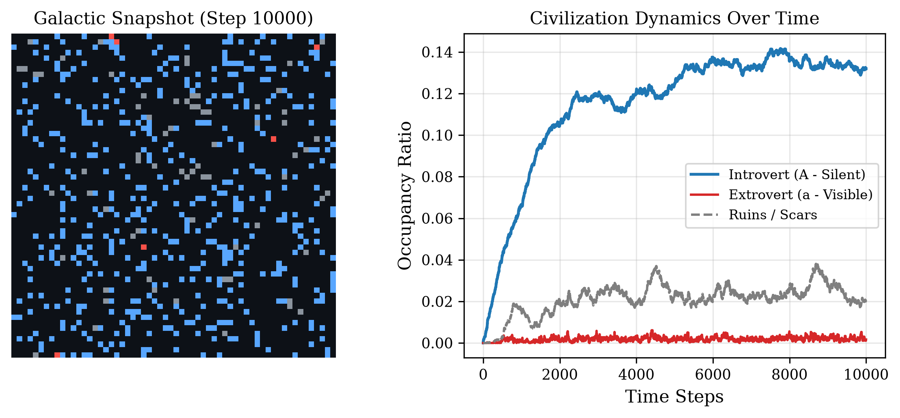
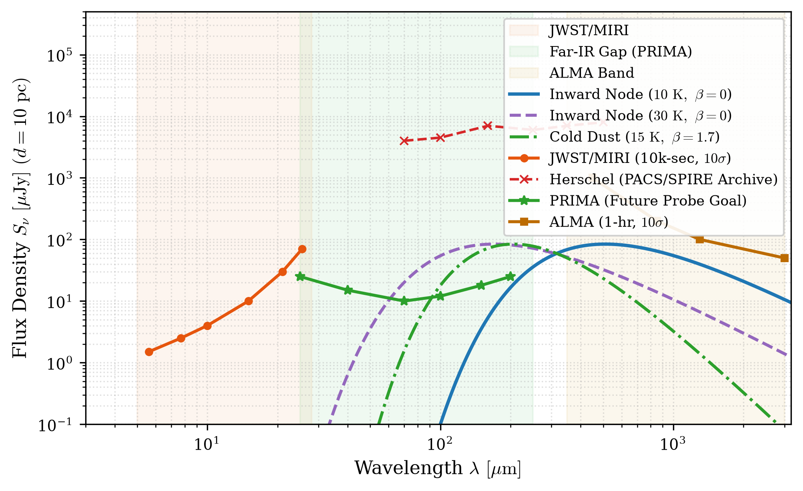
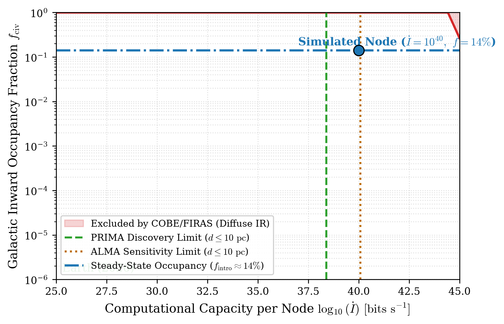

# Thermodynamic Cloaking of Inward Civilizations: Evolutionary Dynamics and Observational Constraints from the Far-Infrared Gap

[](LICENSE)
[](https://creativecommons.org/licenses/by/4.0/)
[](#)
[](#)

> **Why the Great Silence is an inescapable consequence of thermodynamic efficiency rather than biological rarity or existential doom.**

This repository hosts the computational code, analytical models, publication figures, and LaTeX manuscript for the paper:  
**"Thermodynamic Cloaking of Inward Civilizations: Evolutionary Dynamics and Observational Constraints from the Far-Infrared Gap"** by *S Yamashita* (2026).

---

## 🌌 Executive Summary / TL;DR

Classical SETI paradigms presuppose that mature technological civilizations inevitably pursue macroscopic, Kardashev-style astroengineering (Dyson spheres, stellar swarms, relativistic colonization fronts, and energetic radio beacons). Consequently, 60 years of non-detections have been interpreted as either the extreme rarity of abiogenesis (Rare Earth) or catastrophic extinction (The Great Filter).

This work demonstrates that **the macroscopic Kardashev trajectory is physically and organizationally unstable**:

1. **Evolutionary Trapping ($R_0 < 1$):** Causal communication latencies across parsec scales, relativistic travel attrition, and ruin/conflict debris clusters prevent macroscopic percolation. Expansionist civilizations naturally collapse into local ruins.
2. **The Inward Attractor ($f_{\mathrm{intro}} \approx 14\%$):** The evolutionary trajectory of computation follows spatial, temporal, energetic, and material (STEM) compression toward Barrow-scale sub-atomic substrates. Silent, non-expanding computational nodes converge to a stable galactic equilibrium.
3. **Cryogenic Masking (The Far-Infrared Gap):** Maximizing computational density per unit mass mandates Landauer dissipation near cosmic microwave background temperatures ($T_{\mathrm{rad}} \sim 10\text{--}30\ \mathrm{K}$). The bulk of galactic waste heat is shifted directly into the **Far-Infrared Gap ($30\text{--}300\ \mu\mathrm{m}$)**.
4. **Historical Blindness & Near-Term Testability:** This emission seamlessly bypassed past warm-mirror surveys (Herschel noise floor $\sim \mathrm{mJy}$) and mid-IR telescopes (JWST/MIRI cut-off at $28\ \mu\mathrm{m}$). NASA's upcoming cooled-aperture mission **PRIMA** can detect local nodes ($d \le 10\ \mathrm{pc}$) at $5.5\sigma\text{--}8.3\sigma$, with **ALMA** providing submillimeter spectral slope discrimination against natural cold dust.

---

## 📊 Core Scientific Results & Figures

### 1. Galactic Evolutionary Dynamics: Sub-Critical Percolation
We model the galactic disk as a 2D toroidal lattice ($\Lambda = 60 \times 60$, representing 3,600 coarse-grained stellar sectors) undergoing a spatial Moran process with four mutually exclusive states: $\mathrm{Empty}\ (0)$, $\mathrm{Introvert}\ (1)$, $\mathrm{Extrovert}\ (2)$, and $\mathrm{Ruin}\ (3)$.

<p align="center">
  
</p>

* **Percolation Breakdown:** Extrovert clades fail to establish an infinite connected cluster because their effective reproduction number is strictly sub-critical:
  $$R_0 = \frac{p_{\mathrm{expand}}(1 - s_{\mathrm{travel}}) P(\mathrm{Empty})}{\delta_{\mathrm{extro}} + s_{\mathrm{purge}} P(\mathrm{Contact})} \approx 0.42 < 1$$
* **Stable Equilibrium:** Inward clades decouple from territorial expansion and persist for geological timescales, settling at an asymptotic occupancy:
  $$f_{\mathrm{intro}}^* \approx \frac{p_{\mathrm{birth}}}{p_{\mathrm{birth}} + \delta_{\mathrm{intro}} + p_{\mathrm{mutate}}} \approx 0.14$$

---

### 2. Spectroscopic Signatures in the Far-Infrared Gap
Even fully logically reversible cognitive architectures are bound by finite-time thermodynamics and quantum error correction (QEC) state resets, establishing an irreducible non-zero net irreversible erasure rate $\dot{I}_{\mathrm{irr}}$. By Landauer's principle, the minimal thermal dissipation is:
$$P_{\mathrm{waste}} \ge \dot{I}_{\mathrm{irr}} k_B T_{\mathrm{rad}} \ln 2$$

For a planetary-scale substrate with $\dot{I} = 10^{40}\ \mathrm{bits\ s^{-1}}$ operating at $T_{\mathrm{rad}} = 10\ \mathrm{K}$, the required blackbody radiator area is $A_{\mathrm{rad}} \approx 1.69 \times 10^{13}\ \mathrm{m^2}$ ($r \sim 2.3 \times 10^3\ \mathrm{km}$).

<p align="center">
  
</p>

* **JWST/MIRI Blindspot:** Rayleigh-Jeans suppression places cryogenic nodes far below MIRI sensitivity at $\lambda \le 28\ \mu\mathrm{m}$.
* **Herschel Inefficacy:** Herschel's passively cooled mirror ($T_{\mathrm{mirror}} \approx 80\ \mathrm{K}$) imposed a multi-mJy confusion limit, missing the $\sim 80\ \mu\mathrm{Jy}$ peak by two orders of magnitude.
* **PRIMA Detection Envelope:** NASA's actively cooled 1.8-meter telescope (PRIMA) reaches $10\text{--}15\ \mu\mathrm{Jy}$ sensitivity across $25\text{--}200\ \mu\mathrm{m}$, intersecting local nodes ($d \le 10\ \mathrm{pc}$).

---

### 3. Breaking Degeneracy with Natural Interstellar Dust
Natural interstellar dust emits via a modified blackbody (graybody) envelope:
$$S_\nu^{\mathrm{dust}} \propto \nu^\beta B_\nu(T_{\mathrm{dust}}) \quad (\beta \approx 1.5\text{--}2.0)$$
In the submillimeter Rayleigh-Jeans limit ($h\nu \ll k_B T$), the spectral index $\alpha \equiv d\ln S_\nu / d\ln\nu$ breaks this degeneracy:

| Source Type | Emissivity Index $\beta$ | RJ Spectral Index $\alpha = 2 + \beta$ | ALMA Photometric Diagnostic |
| :--- | :---: | :---: | :--- |
| **Engineered Inward Node** | $\beta = 0$ (Pure Planckian) | $\alpha_{\mathrm{node}} \approx 2.0$ | **Flat submm tail ($S_\nu \propto \nu^2$)** |
| **Cold Interstellar Cirrus** | $\beta \approx 1.7$ (Grain opacity) | $\alpha_{\mathrm{dust}} \approx 3.7$ | **Steep drop-off ($S_\nu \propto \nu^{3.7}$)** |

A 20-minute multi-band follow-up with ALMA (Band 7 & Band 9) can measure $\alpha$ to within $\Delta \alpha < 0.15$, definitively verifying an artificial blackbody radiator.

---

### 4. Galactic Background Constraints (COBE/FIRAS)
Integrating over the Milky Way stellar population ($N_\star \approx 10^{11}$ stars):
$$L_{\mathrm{excess}} = f_{\mathrm{intro}} N_\star (\dot{I} k_B T_{\mathrm{rad}} \ln 2)$$

<p align="center">
  
</p>

COBE/FIRAS limits diffuse non-cosmological FIR excess to $L_{\mathrm{limit}} \approx 10^{-3} L_{\mathrm{TIR, MW}} \approx 3.83 \times 10^{33}\ \mathrm{W}$.  
At $T_{\mathrm{rad}} = 15\ \mathrm{K}$ and $f_{\mathrm{intro}} = 0.14$, our simulated node ($\dot{I} = 10^{40}\ \mathrm{bits\ s^{-1}}$) lies **2.4 orders of magnitude below** cosmic diffuse background boundaries. A galaxy hosting hundreds of millions of advanced computational nodes is fully compatible with empirical cosmology.

---

## 🔭 Actionable Roadmap for Astrobiologists

We propose a two-phase observational strategy to detect or constrain inward civilizations:

1. **Target Selection (PRIMA/GERONIMO):**
   * Execute deep-field photometric surveys across $80\text{--}200\ \mu\mathrm{m}$ toward candidate stars within $d \le 10\ \mathrm{pc}$.
   * Filter for point-sources lacking optical (Gaia) or near/mid-infrared (2MASS, WISE, JWST) counterparts.
2. **Follow-Up Confirmation (ALMA):**
   * Target identified candidates with high-resolution submillimeter continuum photometry at $450\ \mu\mathrm{m}$ (Band 9) and $850\ \mu\mathrm{m}$ (Band 7).
   * Confirm artificiality if the measured Rayleigh-Jeans index satisfies $\alpha < 2.5$.
   * Measure astrometric proper motion to confirm bound stellar orbital kinematics.

---

## 📁 Repository Structure

```text
thermodynamic-cloaking/
├── scripts/
│   ├── run_simulation.py      # Spatial Moran process solver (generates Fig 1)
│   └── make_paper_figures.py  # Spectral SED and exclusion generators (generates Figs 2 & 3)
├── figures/                   # High-resolution vector PDFs and 300-DPI PNGs
│   ├── fig1_dynamics.pdf / .png
│   ├── fig2_spectra.pdf / .png
│   └── fig3_exclusion.pdf / .png
├── paper/
│   ├── main.tex               # Complete two-column academic manuscript
│   └── references.bib         # 14 curated BibTeX references
├── requirements.txt           # Python dependencies
├── LICENSE                    # MIT (Code) & CC-BY-4.0 (Manuscript & Figures)
└── README.md
## 🚀 Quickstart & Reproduction
Ensure you have Python 3.10+ installed:
git clone [https://github.com/munder-sa/thermodynamic-cloaking.git](https://github.com/munder-sa/thermodynamic-cloaking.git)
cd thermodynamic-cloaking

# Install dependencies (numpy, matplotlib)
pip install -r requirements.txt

# Run simulation and reproduce all figures (PDF + PNG)
python scripts/run_simulation.py
python scripts/make_paper_figures.py
## 📜 Citation & Attribution
If you reference this work, models, or simulation framework in your research, please cite:
@article{Yamashita2026,
  author    = {Yamashita, S.},
  title     = {Thermodynamic Cloaking of Inward Civilizations: Evolutionary Dynamics and Observational Constraints from the Far-Infrared Gap},
  journal   = {arXiv preprint},
  year      = {2026},
  url       = {[https://github.com/munder-sa/thermodynamic-cloaking](https://github.com/munder-sa/thermodynamic-cloaking)}
}
##📬 Contact & Contributions
Author: S Yamashita (@munder-sa)

Email: munder.sa@gmail.com

Pull requests, analytical extensions (e.g., non-uniform stellar distributions, multi-clade game theory), and observational collaborations are welcome!
